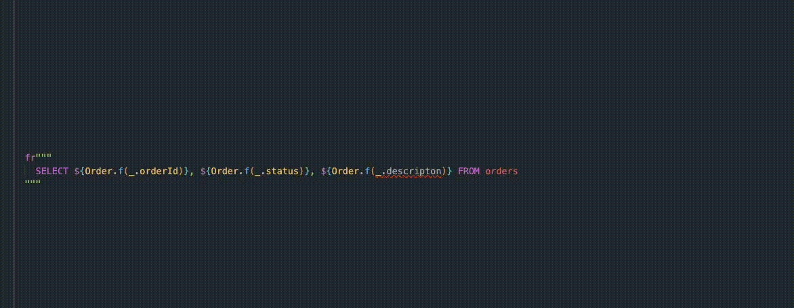

# Forge

A sophisticated repository template for Scala 3 applications using [Doobie](https://tpolecat.github.io/doobie/). Features generic CRUD operations, FSP (Filter/Sort/Paginate), upserts, batch operations, and type-safe SQL fragment building.

---

> Lemme forge that boilerplate code for ya


## Table of Contents

- [Features](#features)
- [Installation](#installation)
- [Quick Start](#quick-start)
- [Core Components](#core-components)
  - [TypesafeFragments](#typesafefragments)
  - [AbstractView](#abstractview)
  - [AbstractRepository](#abstractrepository)
- [Mixins](#mixins)
  - [IdentifiedBy](#identifiedby)
  - [Filtering](#filtering)
  - [FSP (Filter-Sort-Paginate)](#fsp-filter-sort-paginate)
  - [Joined](#joined)
  - [Updates](#updates)
  - [Deletions](#deletions)
  - [Upsertions](#upsertions)
- [Forge and Dependency Injection](#forge-and-dependency-injection)
- [Examples](#examples)
- [Contributing](#contributing)
- [License](#license)

## Features

- **Type-Safe SQL Generation**: Compile-time field name extraction
- **Composable Repository Pattern**: Mix and match functionality through trait composition
- **Flexible Entity Mapping**: Support for both simple and complex domain-to-database mappings
- **Advanced Querying**: Built-in support for filtering, sorting, pagination, and joins
- **Doobie Integration**: Seamless integration with the Doobie functional database layer

## Installation

[](https://maven-badges.sml.io/sonatype-central/io.github.stivens/doobie-forge_3)

`build.sbt`:

```scala
libraryDependencies += "io.github.stivens" %% "doobie-forge" % "0.2.0"
```

`scala-cli`:

```scala
//> using lib "io.github.stivens::doobie-forge:0.2.0"
```


## Quick Start

Here's a simple example to get you started:

```scala
import doobie.*
import doobie.implicits.*
import io.github.stivens.forge.*

case class User(id: Long, name: String, email: String) derives Read, Write

object UserRepository extends AbstractRepository.Simple[User](tableName = "users")

val users = List(
  User(id = 1, name = "John Doe", email = "john@example.com"),
  User(id = 2, name = "Jane Smith", email = "jane@example.com")
)

// Create users
val createdUsers: ConnectionIO[List[User]] = UserRepository.createMany(users)

// Retrieve all users
val allUsers: ConnectionIO[List[User]] = UserRepository.getAll
```

## Core Components

### TypesafeFragments

The `TypesafeFragments` trait provides type-aware field interpolation. It allows you to inspect types and avoid typos - no more stringly-typed queries!



```scala
class TypesafeFragmentsSpec extends AnyFunSpec {
  describe("given TypesafeFragments trait") {
    case class Order(
        orderId: Long,
        clientId: Long,
        value: Double,
        description: String
    )
    object Order extends TypesafeFragments[Order]

    case class Client(
        clientId: Long,
        name: String,
        sex: String
    )
    object Client extends TypesafeFragments[Client]

    it("should interpolate field names (explicit type selector)") {
      assert {
        fr"SELECT ${Order.f(_.orderId)}, ${Order.f(_.clientId)} FROM orders".toString ==
          """Fragment("SELECT "orderid", "clientid" FROM orders ")"""
      }
    }

    it("should interpolate field names (imported from case class)") {
      import Order.*
      assert {
        fr"SELECT ${f(_.orderId)}, ${f(_.clientId)} FROM orders".toString ==
          """Fragment("SELECT "orderid", "clientid" FROM orders ")"""
      }
    }

    it("should interpolate field names with alias (explicit type selector)") {
      assert {
        fr"""
            SELECT
              ${Order.fieldWithAlias("order")(_.orderId)},
              ${Order.fieldWithAlias("order")(_.clientId)},
              ${Client.fieldWithAlias("client")(_.name)}
              FROM orders AS "order"
              JOIN clients AS client
              ON ${Order.fieldWithAlias("order")(_.clientId)} = ${Client.fieldWithAlias("client")(_.clientId)}
        """.toString.replaceAll("\\s+", " ") ==
          """Fragment(" SELECT "order"."orderid" , "order"."clientid" , "client"."name" FROM orders AS "order" JOIN clients AS client ON "order"."clientid" = "client"."clientid" ")"""
      }
    }

    it("should interpolate field names with alias (with defined inline alias)") {
      inline def order(inline selector: Order => Any): Fragment   = Order.fieldWithAlias("order")(selector)
      inline def client(inline selector: Client => Any): Fragment = Client.fieldWithAlias("client")(selector)

      assert {
        fr"""
            SELECT
            ${order(_.orderId)},
            ${order(_.clientId)},
            ${client(_.name)}
            FROM orders AS "order"
            JOIN clients AS client
            ON ${order(_.clientId)} = ${client(_.clientId)}
        """.toString.replaceAll("\\s+", " ") ==
          """Fragment(" SELECT "order"."orderid" , "order"."clientid" , "client"."name" FROM orders AS "order" JOIN clients AS client ON "order"."clientid" = "client"."clientid" ")"""
      }
    }

    it("should interpolate frSet/frEq fragments") {
      import Order.*
      assert {
        fr"UPDATE orders SET ${frSet(_.value, 99.99)} WHERE ${frEq(_.orderId, 1L)}".toString.replaceAll("\\s+", " ") ==
          """Fragment("UPDATE orders SET "value" = ? WHERE "orderid" = ? ")"""
      }
    }

    it("should interpolate frOp fragments") {
      import Order.*
      assert {
        fr"SELECT * FROM orders WHERE ${frOp(_.value, fr">", 99.99)}".toString.replaceAll("\\s+", " ") ==
          """Fragment("SELECT * FROM orders WHERE "value" > ? ")"""
      }
      assert {
        fr"SELECT * FROM orders WHERE ${frOp(99.99, fr">", _.value)}".toString.replaceAll("\\s+", " ") ==
          """Fragment("SELECT * FROM orders WHERE ? > "value" ")"""
      }
    }
  }
}
```


### AbstractView

`AbstractView` provides read-only access to database entities. It serves as the foundation for implementing database views and read-only repositories.

```scala
case class Movie(id: Long, name: String, director: String, rating: Double) derives Read

object MovieView extends AbstractView.Simple[Movie](tableName = "movies")

// Retrieve all movies
val movies: ConnectionIO[List[Movie]] = MovieView.getAll

// Count all movies
val count: ConnectionIO[Int] = MovieView.countAll
```


### AbstractRepository

`AbstractRepository` extends `AbstractView` to provide both read and write access. It handles entity creation and conversion between domain and database entities.

#### Simple Repository (Entity = DbEntity)

```scala
case class User(id: Long, name: String, email: String) derives Read, Write

object UserRepository extends AbstractRepository.Simple[User](tableName = "users")

// Create users
val createdManyUsers = UserRepository.createMany(users)
val createdUser = UserRepository.create(user)
```

#### Repository with Intermediate Type

```scala
case class Address(street: String, city: String, state: String, zip: String)
case class Person(id: Long, firstName: String, lastName: String, address: Address)

case class DbPerson(
    id: Long,
    first_name: String,
    last_name: String,
    address_street: String,
    address_city: String,
    address_state: String,
    address_zip: String
) derives Read, Write

object PersonRepository extends AbstractRepository.WithIntermediateType[Person, DbPerson](
  tableName = "people",
  dbMapping = new DbMapping[Person, DbPerson] {
    def dbToEntity(db: DbPerson): Person =
      Person(
        id = db.id,
        firstName = db.first_name,
        lastName = db.last_name,
        address = Address(street = db.address_street, city = db.address_city, state = db.address_state, zip = db.address_zip)
      )
    def entityToDb(entity: Person): DbPerson =
      DbPerson(
        id = entity.id,
        first_name = entity.firstName,
        last_name = entity.lastName,
        address_street = entity.address.street,
        address_city = entity.address.city,
        address_state = entity.address.state,
        address_zip = entity.address.zip
       )
  }
)
```

#### Custom methods

```scala
  object UserRepository extends AbstractRepository.Simple[User](tableName = "users") {
    // -------- some of the methods inherited from the AbstractView ----------

    // protected def frSelectColumnsFromTable: Fragment = fr"SELECT $frColumns FROM $tableName"

    // final protected def selectWith(fragment: Fragment): ConnectionIO[List[Entity]] =
    //   runSelect(frSelectColumnsFromTable ++ fragment)

    // final protected def runSelect(sql: Fragment): ConnectionIO[List[Entity]] =
    //   sql
    //     .query[DbEntity]
    //     .map(dbToEntity)
    //     .to[List]

    // ------------------------------------------------------------

    def getAllUsersThatHaveNoEmailSpecified: ConnectionIO[List[User]] =
      selectWith(fr"WHERE email IS NULL") // SELECT f1, f2, ..., email, ... FROM users WHERE email IS NULL

    def getNumberOfOrders: ConnectionIO[List[(UserId, Int)]] = {
      inline def order(inline selector: Order => Any): Fragment = Order.fieldWithAlias("order")(selector)
      inline def user(inline selector: User => Any): Fragment   = User.fieldWithAlias("user")(selector)

      sql"""
        SELECT ${user(_.id)}, COUNT(*)
        FROM $tableName
        INNER JOIN ${OrderRepository.tableName} AS "order" ON ${order(_.clientId)} = ${user(_.id)}
        GROUP BY ${user(_.id)}
      """.query[(UserId, Int)].to[List]
    }
  }
```

## Mixins

Mixins provide composable functionality that can be mixed into repositories and views.

### IdentifiedBy

Enables ID-based operations on entities.

```scala
type UserId = Long
case class User(id: UserId, name: String, email: String) derives Read, Write

object UserRepository extends AbstractRepository.Simple[User]("users")
  with IdentifiedBy[User, UserId](extractId = _.id, /* frId = fr"id" */)

// Get user by ID
val user: ConnectionIO[Option[User]] = UserRepository.getById(1)

// Get user by ID or fail if they are missing
val user: ConnectionIO[User] = UserRepository.getByIdOrFail(1)

// Get multiple users by IDs
val users: ConnectionIO[List[User]] = UserRepository.getManyByIds(List(1, 2, 3))

// Get users as a map
val usersById: ConnectionIO[Map[Long, User]] = UserRepository.getManyByIdsToMap(List(1, 2, 3))
```

### Filtering

Provides flexible filtering capabilities using filter types.

```scala
case class Movie(id: Long, name: String, director: String, rating: Double) derives Read, Write

case class MovieFilter(
  name_like: Option[String] = None,
  director_eq: Option[String] = None,
  rating_gte: Option[Double] = None
)

object MovieRepository extends AbstractView.Simple[Movie]("movies")
  with Filtering[Movie, MovieFilter](
    handleFilter = toFragments[MovieFilter]
      .usingNonEmpty(_.name_like)(name => fr"name LIKE ${%%(name)}")
      .usingNonEmpty(_.director_eq)(director => fr"director = ${director}")
      .usingNonEmpty(_.rating_gte)(rating => fr"rating >= ${rating}")
      .compile
  )

// Filter movies
val filter = MovieFilter(director_eq = Some("Director 1"), rating_gte = Some(4.0))
val movies: ConnectionIO[List[Movie]] = MovieRepository.getManyByFilter(filter)
val filteredCount: ConnectionIO[Int] = MovieRepository.countByFilter(filter)
```

### FSP (Filter-Sort-Paginate)

Provides advanced querying with filtering, sorting, and cursor-based pagination.

```scala
case class Movie(id: Long, name: String, director: String, rating: Double) derives Read, Write

case class MovieFilter(
  name_like: Option[String] = None,
  director_eq: Option[String] = None,
  rating_gte: Option[Double] = None
)

type MovieCursor = Movie

enum MovieOrder { case ID, NAME, DIRECTOR, RATING }

object MovieOrder {
  given OrderDefaultValue[MovieOrder] = new OrderDefaultValue[MovieOrder] {
    override def get: MovieOrder = MovieOrder.ID
  }
}

object MovieRepository extends AbstractView.Simple[Movie]("movies")
  with Filtering[Movie, MovieFilter](/* ... filter setup ... */)
  with FSP[Movie, Movie, MovieFilter, MovieOrder, MovieCursor](
    evalOrder = sortDefinition =>
      comma(
        (sortDefinition.by match {
          case MovieOrder.ID => NonEmptyList.of(fr"id")
          case MovieOrder.NAME => NonEmptyList.of(fr"name", fr"id")
          case MovieOrder.DIRECTOR => NonEmptyList.of(fr"director", fr"id")
          case MovieOrder.RATING => NonEmptyList.of(fr"rating", fr"id")
        }).map(_ ++ sortDefinition.frAscOrDesc)
      ),
    evalCursor = (cursor, sortDefinition) =>
      sortDefinition.by match {
        case MovieOrder.ID => fr"id ${sortDefinition.frSortSign} ${cursor.id}"
        case MovieOrder.NAME => fr"(name, id) ${sortDefinition.frSortSign} (${cursor.name}, ${cursor.id})"
        case MovieOrder.DIRECTOR => fr"(director, id) ${sortDefinition.frSortSign} (${cursor.director}, ${cursor.id})"
        case MovieOrder.RATING => fr"(rating, id) ${sortDefinition.frSortSign} (${cursor.rating}, ${cursor.id})"
      },
    constructCursor = movie => movie
  )

// FSP query
val request = FSPRequest(
  pageSize = Some(10),
  filter = Some(MovieFilter(director_eq = Some("Director 1"), rating_gte = Some(4.0))),
  sort = Some(SortDefinition(by = MovieOrder.RATING, ascOrDesc = AscOrDesc.DESC))
)
val response: ConnectionIO[FSPResponse[Movie, MovieCursor]] = MovieRepository.fsp(request)
```

### Joined

Enables JOIN operations with automatic DISTINCT handling and table aliases.

```scala
case class Order(orderId: Long, clientId: Long, value: Double, description: String) derives Read, Write

case class OrderFilter(
  value_gte: Option[Double] = None,
  clientName_like: Option[String] = None,
  clientSex_eq: Option["F" | "M"] = None
)

object OrderView extends AbstractView.Simple[Order]("orders")
  with IdentifiedBy[Order, Long](_.orderId, fr"orderId")
  with Joined(
    frAlias = safeConst0Quoted("order"),
    frJoin = fr"""JOIN clients AS client ON "order".clientId = client.clientId"""
  )
  with Filtering[Order, OrderFilter](
    handleFilter = toFragments[OrderFilter]
      .usingNonEmpty(_.value_gte)(value => fr"value >= ${value}")
      .usingNonEmpty(_.clientName_like)(clientName => fr"client.name LIKE ${%%(clientName)}")
      .usingNonEmpty(_.clientSex_eq)(clientSex => fr"client.sex = ${clientSex}")
      .compile
  )
```

### Updates

Provides update capabilities using flexible update types.

```scala
case class User(id: Long, name: String, email: String) derives Read, Write

case class UpdateUser(name: Option[String] = None, email: Option[String] = None)

object UserRepository extends AbstractRepository.Simple[User]("users")
  with IdentifiedBy[User, Long](_.id)
  with Updates[User, Long, UpdateUser](
    handleUpdate = toFragments[UpdateUser]
      .usingNonEmpty(_.name)(name => fr"name = ${name}")
      .usingNonEmpty(_.email)(email => fr"email = ${email}")
      .compile
  )

// Update user
val update = UpdateUser(name = Some("John Doe"))
val updatedUser: ConnectionIO[Option[User]] = UserRepository.update(1, update)

// Update multiple users
val updatedUsers: ConnectionIO[List[User]] = UserRepository.updateMany(List(1, 2), update)
```

### Deletions

Provides deletion capabilities that return deleted entities.

```scala
case class User(id: Long, name: String, email: String) derives Read, Write

object UserRepository extends AbstractRepository.Simple[User]("users")
  with IdentifiedBy[User, Long](_.id)
  with Deletions[User, Long]

// Delete user
val deletedUser: ConnectionIO[Option[User]] = UserRepository.delete(1)

// Delete multiple users
val deletedUsers: ConnectionIO[List[User]] = UserRepository.deleteMany(List(1, 2))
```

### Upsertions

Provides upsert (insert or update) capabilities using PostgreSQL's `ON CONFLICT DO UPDATE`.

```scala
case class User(id: Long, name: String, email: String) derives Read, Write

object UserRepository extends AbstractRepository.Simple[User]("users")
  with IdentifiedBy[User, Long](_.id)
  with Upsertions[User]

// Upsert user
val user = User(id = 1, name = "John Doe", email = "john.doe@example.com")
val upsertedUser: ConnectionIO[User] = UserRepository.upsert(user)
```

## Forge and Dependency Injection

Forge's interface-based design makes it perfect for dependency injection. You can easily swap implementations for testing.

### The `forge.interface.*` package

Forge provides several interface traits that define specific capabilities:

- `GetAllOps[T]` - Provides `getAll` and `countAll` operations
- `GetByIdOps[T, Id]` - Provides ID-based retrieval operations (`getById`, `getByIdOrFail`, `getManyByIds`)
- `CreateOps[T]` - Provides entity creation operations (`create`, `createMany`, `createManyWithOnConflictDoHandle`)
- `UpdateOps[T, Id, Update]` - Provides update operations (`update`, `updateMany`)
- `DeleteOps[T, Id]` - Provides deletion operations (`delete`, `deleteMany`)
- `UpsertOps[T]` - Provides upsert operations (`upsert`, `upsertMany`)
- `FilterOps[T, Filter]` - Provides filtering operations (`getManyByFilter`, `countByFilter`)
- `FSPOps[T, Filter, Order, Cursor]` - Provides Filter-Sort-Paginate operations (`fsp`)

### Dependency Injection Example

Here's a complete example showing how to use Forge with dependency injection:

```scala
import cats.*
import cats.data.NonEmptyList
import cats.effect.*
import cats.effect.unsafe.implicits.global
import doobie.*
import doobie.free.connection
import doobie.implicits.*
import io.github.stivens.forge.AbstractRepository
import io.github.stivens.forge.mixins.*
import io.github.stivens.forge.testsetup.transactor
import org.scalatest.funspec.AnyFunSpec

class DependencyInjectionExample extends AnyFunSpec {
  describe("given simple dependency injection example") {
    case class Movie(id: Long, name: String, director: String, rating: Double)
    case class DirectorAverageRating(director: String, averageRating: Double)

    class DirectorAverageRatingRefresherService(
        movieRepository: GetAllOps[Movie],
        directorAverageRatingRepository: UpsertOps[DirectorAverageRating]
    ) {
      def refresh(): List[DirectorAverageRating] = (for {
        movies <- movieRepository.getAll
        directorAverageRatings = calculateDirectorAverageRating(movies)
        _ <- directorAverageRatingRepository.upsertMany(directorAverageRatings)
      } yield directorAverageRatings).transact(transactor).unsafeRunSync()

      private def calculateDirectorAverageRating(movies: List[Movie]): List[DirectorAverageRating] =
        movies
          .groupBy(_.director)
          .map { case (director, movies) =>
            DirectorAverageRating(director, movies.map(_.rating).sum / movies.size)
          }
          .toList
    }

    describe("conrecte repositories") {
      object MovieRepository extends AbstractRepository.Simple[Movie]("movies")
      object DirectorAverageRatingRepository
          extends AbstractRepository.Simple[DirectorAverageRating]("director_average_ratings")
          with IdentifiedBy[DirectorAverageRating, String](extractId = _.director, frId = fr"director")
          with Upsertions[DirectorAverageRating]

      it("should be subtypes of the required interfaces") {
        assert(MovieRepository.isInstanceOf[GetAllOps[Movie]])
        assert(DirectorAverageRatingRepository.isInstanceOf[UpsertOps[DirectorAverageRating]])

        assert {
          DirectorAverageRatingRepository.isInstanceOf[
            GetAllOps[DirectorAverageRating] & CreateOps[DirectorAverageRating] & UpsertOps[DirectorAverageRating] &
              GetByIdOps[DirectorAverageRating, String]
          ]
        }

      }

      it("should be injectable") {
        val DirectorAverageRatingRefresherService =
          new DirectorAverageRatingRefresherService(MovieRepository, DirectorAverageRatingRepository)
        assert(true) // it compiles
      }
    }

    describe("given mock instances") {
      val upsertRequestsLog = scala.collection.mutable.ListBuffer[DirectorAverageRating]()

      val directorAverageRatingRefresherService = new DirectorAverageRatingRefresherService(
        movieRepository = new GetAllOps[Movie] {
          val movies = List(
            Movie(1, "Movie 1", "Director 1", 5.0),
            Movie(2, "Movie 2", "Director 1", 4.0),
            Movie(3, "Movie 3", "Director 2", 3.0)
          )
          override def getAll: ConnectionIO[List[Movie]] = connection.pure(movies)
          override def countAll: ConnectionIO[Int]       = connection.pure(movies.size)
        },
        directorAverageRatingRepository = new UpsertOps[DirectorAverageRating] {
          override def upsertMany(entities: NonEmptyList[DirectorAverageRating]): ConnectionIO[List[DirectorAverageRating]] = {
            upsertRequestsLog.addAll(entities.toList)
            connection.pure(entities.toList)
          }
        }
      )

      it("we should be able to test the service") {
        val returnedValue  = directorAverageRatingRefresherService.refresh().sortBy(_.director)
        val upsertRequests = upsertRequestsLog.toList.sortBy(_.director)

        val expectedREsult = List(
          DirectorAverageRating("Director 1", 4.5),
          DirectorAverageRating("Director 2", 3.0)
        )

        assert(returnedValue == expectedREsult)
        assert(upsertRequests == expectedREsult)
      }
    }
  }
}
```

## Examples

### Complete Repository Example

Here's a complete example showing how to combine multiple mixins:

```scala
import cats.data.NonEmptyList

import doobie.*
import doobie.Fragments.*
import doobie.implicits.*
import doobie.postgres.implicits.*

import io.github.stivens.forge.*
import io.github.stivens.forge.mixins.*
import io.github.stivens.forge.interface.FSPOps.*

import java.time.LocalDate

type MovieId = Long

case class Movie(
    id: MovieId,
    name: String,
    director: String,
    releaseDate: LocalDate,
    rating: Double
) derives Read,
      Write
object Movie extends TypesafeFragments[Movie]

case class MovieFilter(
    name_like: Option[String] = None,
    director_eq: Option[String] = None,
    releaseDate_gte: Option[LocalDate] = None,
    releaseDate_lte: Option[LocalDate] = None,
    rating_gte: Option[Double] = None,
    rating_lte: Option[Double] = None
)

case class MovieUpdate(
    name: Option[String] = None,
    director: Option[String] = None,
    rating: Option[Double] = None
)

type MovieCursor = Movie

enum MovieOrder {
  case ID, NAME, DIRECTOR, RELEASE_DATE, RATING
}

object MovieOrder {
  given OrderDefaultValue[MovieOrder] = new OrderDefaultValue[MovieOrder] {
    override def get: MovieOrder = MovieOrder.ID
  }
}

object MovieRepository
    extends AbstractRepository.Simple[Movie](tableName = "movies")
    with IdentifiedBy[Movie, MovieId](extractId = _.id, frId = fr"id")
    with Filtering[Movie, MovieFilter](
      handleFilter = toFragments[MovieFilter]
        .usingNonEmpty(_.name_like)(name => fr"${Movie.f(_.name)} LIKE ${%%(name)}")
        .usingNonEmpty(_.director_eq)(director => Movie.frEq(_.director, director))
        .usingNonEmpty(_.releaseDate_gte)(releaseDate => Movie.frOp(_.releaseDate, fr">=", releaseDate))
        .usingNonEmpty(_.releaseDate_lte)(releaseDate => Movie.frOp(_.releaseDate, fr"<=", releaseDate))
        .usingNonEmpty(_.rating_gte)(rating => Movie.frOp(_.rating, fr">=", rating))
        .usingNonEmpty(_.rating_lte)(rating => Movie.frOp(_.rating, fr"<=", rating))
        .compile
    )
    with Updates[Movie, MovieId, MovieUpdate](
      handleUpdate = toFragments[MovieUpdate]
        .usingNonEmpty(_.name)(Movie.frSet(_.name, _))         // (name => fr"name = ${name}")
        .usingNonEmpty(_.director)(Movie.frSet(_.director, _)) // (director => fr"director = ${director}")
        .usingNonEmpty(_.rating)(Movie.frSet(_.rating, _))     // (rating => fr"rating = ${rating}")
        .compile
    )
    with Deletions[Movie, MovieId]
    with FSP[Movie, Movie, MovieFilter, MovieOrder, MovieCursor](
      evalOrder = sortDefinition =>
        comma(
          (sortDefinition.by match {
            case MovieOrder.ID           => NonEmptyList.of(Movie.f(_.id))                         // fr"id"
            case MovieOrder.NAME         => NonEmptyList.of(Movie.f(_.name), Movie.f(_.id))        // fr"name", fr"id"
            case MovieOrder.DIRECTOR     => NonEmptyList.of(Movie.f(_.director), Movie.f(_.id))    // fr"director", fr"id"
            case MovieOrder.RELEASE_DATE => NonEmptyList.of(Movie.f(_.releaseDate), Movie.f(_.id)) // fr"releaseDate", fr"id"
            case MovieOrder.RATING       => NonEmptyList.of(Movie.f(_.rating), Movie.f(_.id))      // fr"rating", fr"id"
          }).map(_ ++ sortDefinition.frAscOrDesc) // fr"name ASC, id ASC" etc.
        ),
      evalCursor = (cursor, sortDefinition) =>
        sortDefinition.by match {
          case MovieOrder.ID =>
            fr"id ${sortDefinition.frSortSign} ${cursor.id}" // fr"id (>/<) ?"
          case MovieOrder.NAME =>
            fr"(name, id) ${sortDefinition.frSortSign} (${cursor.name}, ${cursor.id})" // fr"(name, id) (>/<) (?, ?)"
          case MovieOrder.DIRECTOR =>
            fr"(director, id) ${sortDefinition.frSortSign} (${cursor.director}, ${cursor.id})" // fr"(director, id) (>/<) (?, ?)"
          case MovieOrder.RELEASE_DATE =>
            fr"(releaseDate, id) ${sortDefinition.frSortSign} (${cursor.releaseDate}, ${cursor.id})" // fr"(releaseDate, id) (>/<) (?, ?)"
          case MovieOrder.RATING =>
            fr"(rating, id) ${sortDefinition.frSortSign} (${cursor.rating}, ${cursor.id})" // fr"(rating, id) (>/<) (?, ?)"
        },
      constructCursor = movie => movie
    )

// Usage examples
val movies = List(
  Movie(id = 1, name = "Movie 1", director = "Director 1", releaseDate = LocalDate.of(2024, 1, 1), rating = 5.0),
  Movie(id = 2, name = "Movie 2", director = "Director 2", releaseDate = LocalDate.of(2024, 1, 2), rating = 4.0)
)

// Create movies
val createdMovies = MovieRepository.createMany(movies)

// Get movie by ID
val movie = MovieRepository.getById(1)

// Filter movies
val filter         = MovieFilter(director_eq = Some("Director 1"), rating_gte = Some(4.0))
val filteredMovies = MovieRepository.getManyByFilter(filter)

// FSP query
val fspRequest = FSPRequest(
  pageSize = Some(10),
  filter = Some(MovieFilter(rating_gte = Some(4.0))),
  sort = Some(SortDefinition(by = MovieOrder.RATING, ascOrDesc = AscOrDesc.DESC))
)
val fspResult = MovieRepository.fsp(fspRequest)

// Update movie
val update       = MovieUpdate(name = Some("Updated Movie Name"))
val updatedMovie = MovieRepository.update(1, update)

// Delete movie
val deletedMovie = MovieRepository.delete(1)

```

## Requirements

- Scala >= 3.3
- **Database Compatibility Warning**: This library has been tested and developed primarily with PostgreSQL. While it may work with other DBMS, compatibility is not guaranteed. If you plan to use this library with other DBMS, please test thoroughly and be aware that you may need to adapt or implement alternative solutions for certain features.

## Contributing

Contributions are welcome! Please feel free to submit a Pull Request.

## License

This project is licensed under the MIT License - see the LICENSE file for details.
